# BasicDiet145 – Architecture & Diagrams

This document provides visual architecture diagrams for the BasicDiet145 backend system.

---

## System Architecture Overview

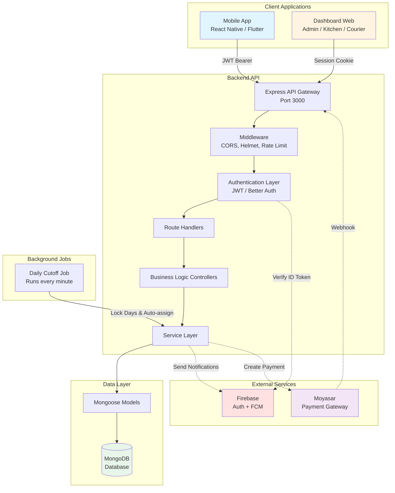

---

## Authentication Flow

### Client (Mobile) Authentication

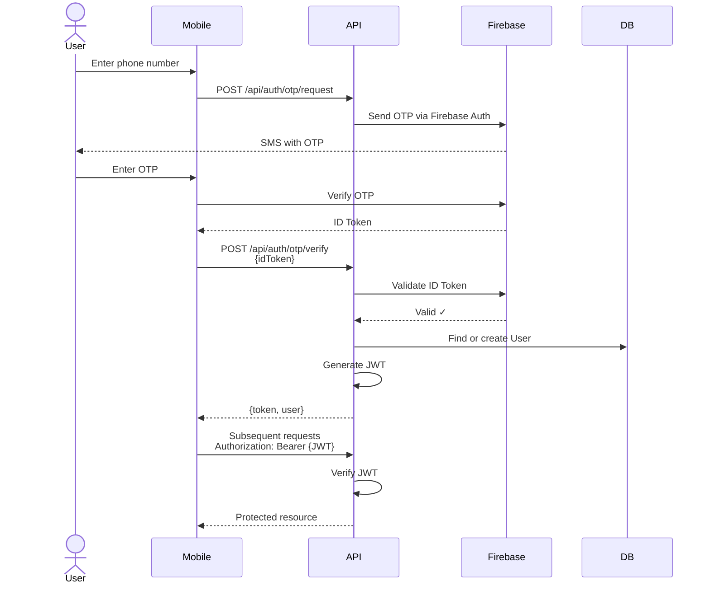

### Dashboard Authentication

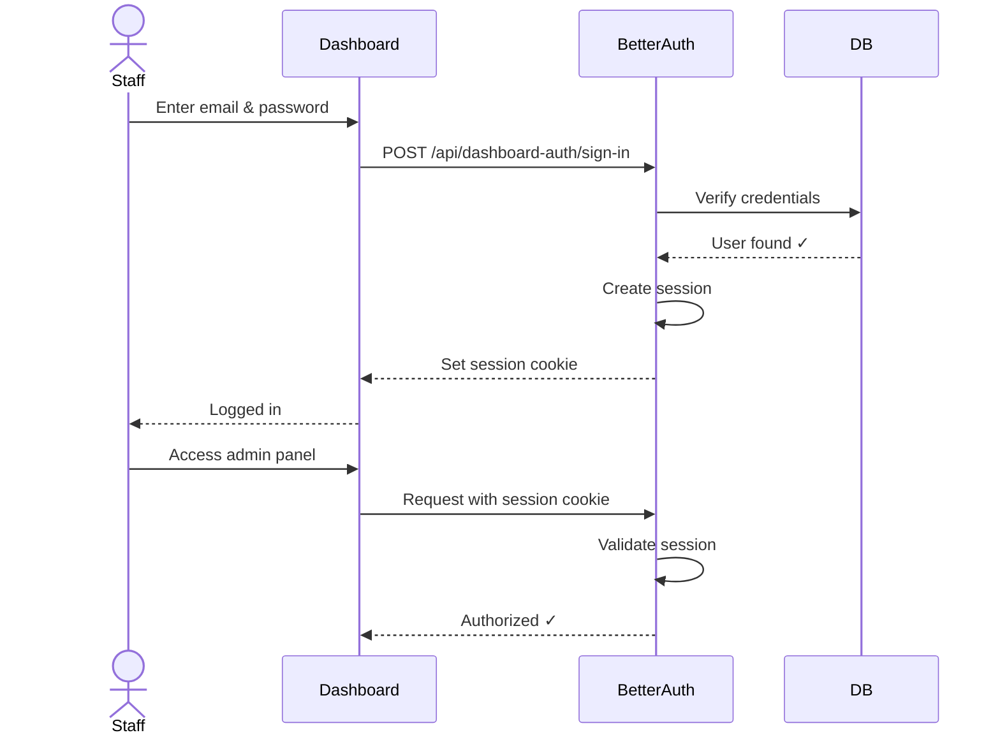

---

## Subscription Lifecycle

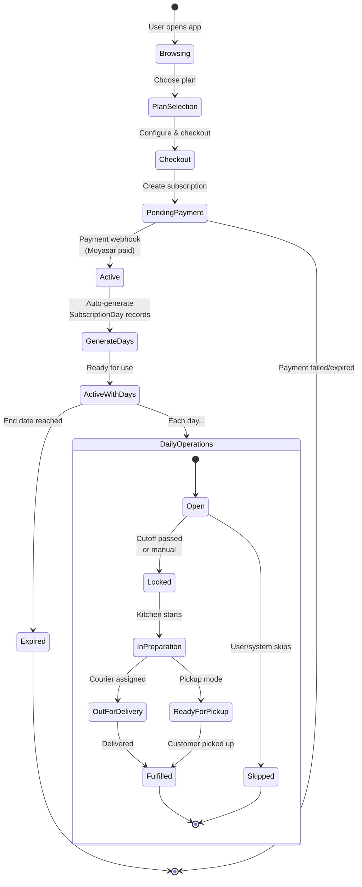

---

## SubscriptionDay State Machine

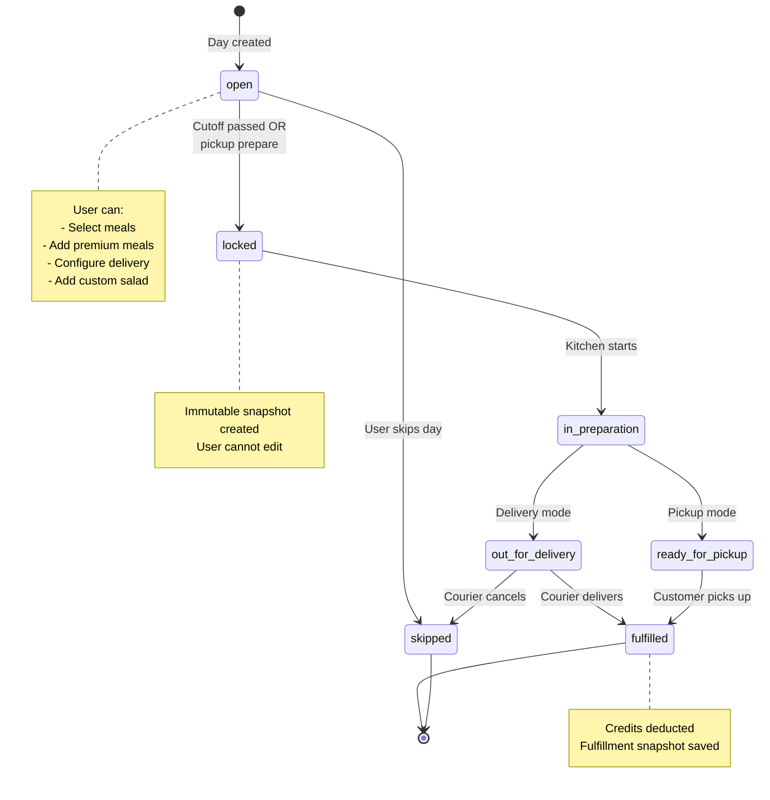

---

## Order (One-Time) State Machine

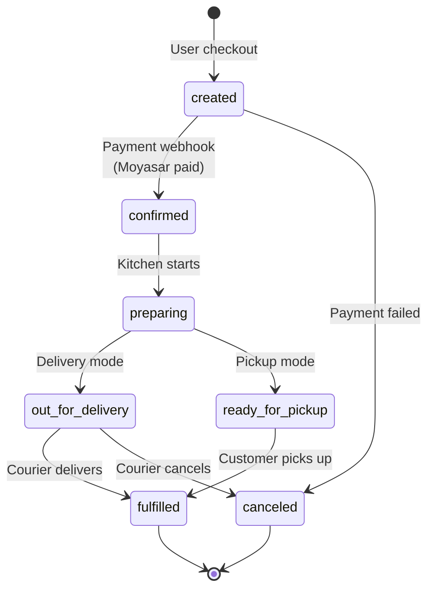

---

## Payment Integration Flow

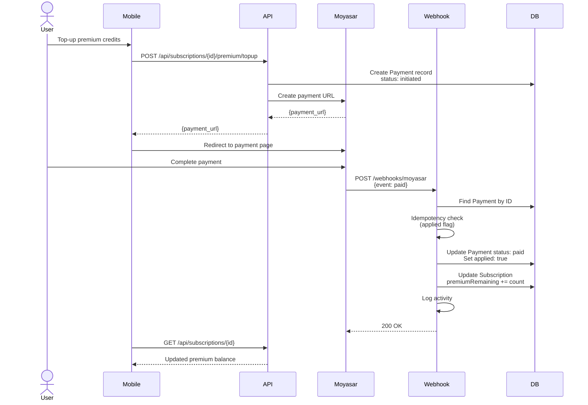

---

## Daily Cutoff Automation

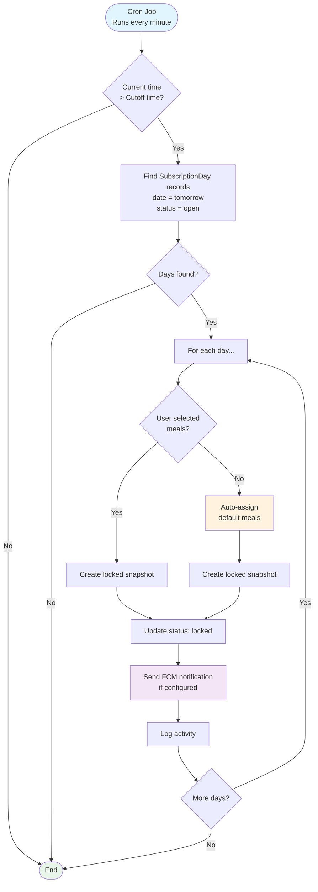

---

## Custom Salad Pricing Flow

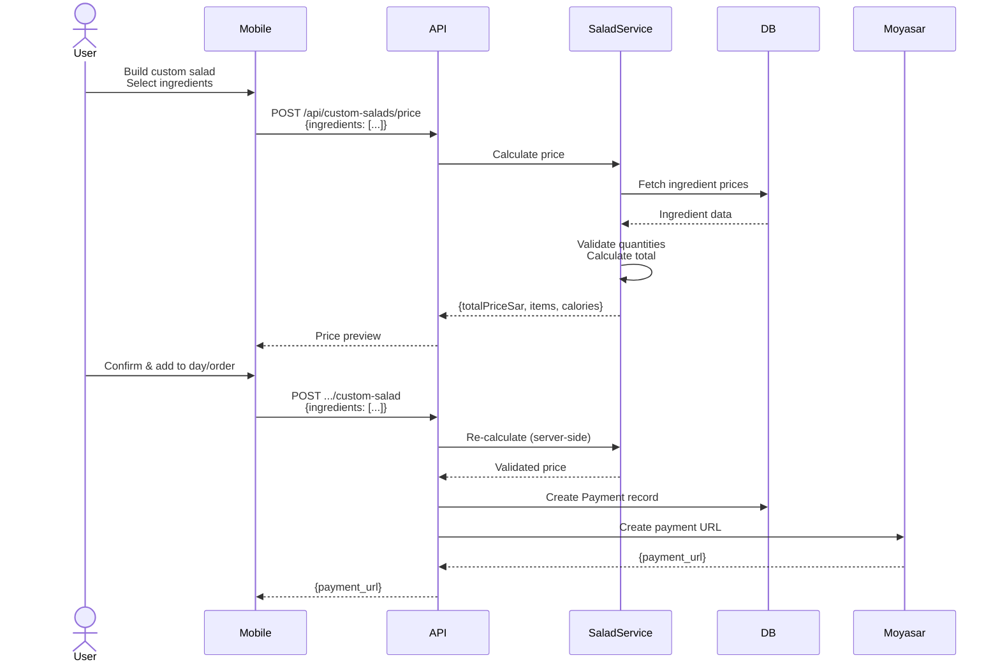

---

## Data Model Relationships

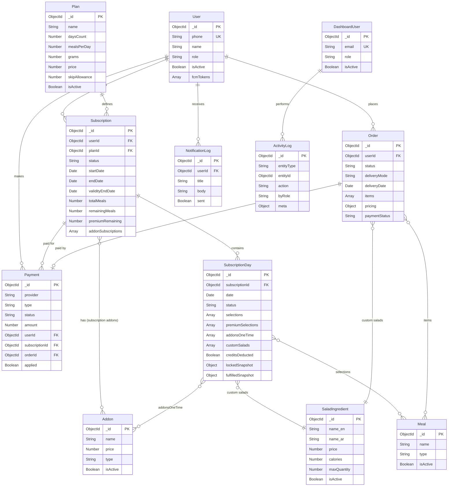

---

## API Route Hierarchy

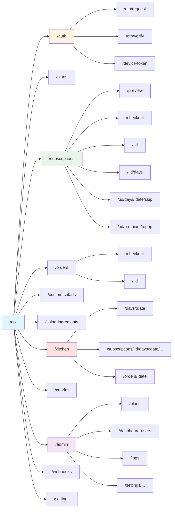

---

## Technology Stack

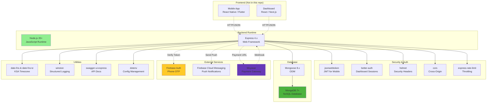

---

## Deployment Architecture (Recommended)

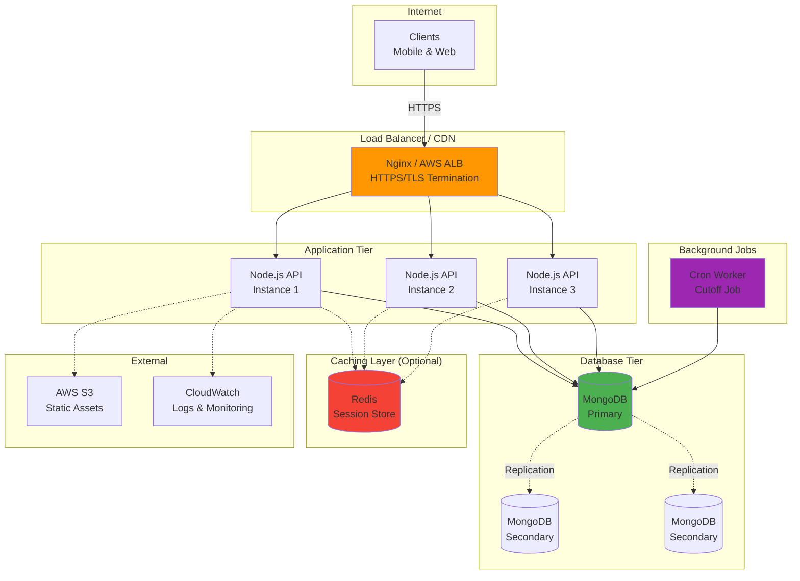

---

This document provides comprehensive visual representations of the BasicDiet145 architecture, workflows, and data models.

For additional information, refer to the main `DOCUMENTATION.md` file.
