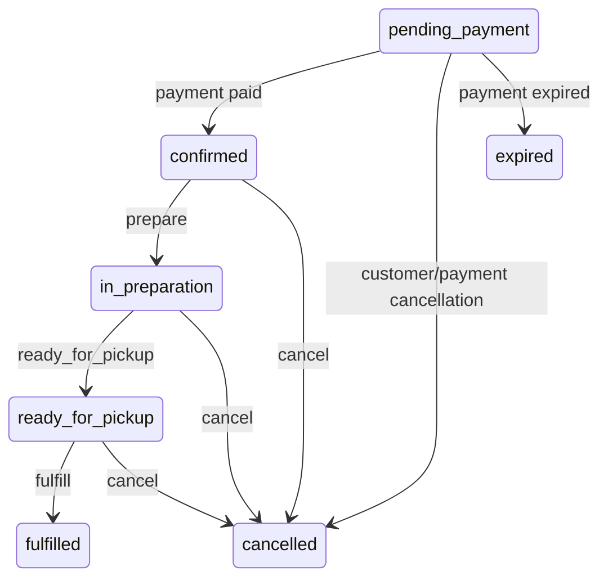

# Frontend Order Lifecycle Documentation

This document is the frontend handoff source for the current backend/product order flow. It covers:

- Auth flow
- One-time pickup order lifecycle
- Real backend order statuses
- Backend-driven actions
- Timeline API usage
- Cancellation handling
- Frontend rendering rules

Frontend must depend on backend source of truth for:

- `status`
- `allowedActions`
- role permissions
- timeline data
- cancellation reason/source

Do not invent local statuses or actions. Do not render buttons from status alone. Do not build the primary timeline locally when the backend timeline endpoint is available.

Important current product decisions:

- One-time delivery is disabled. Hide one-time delivery controls and delivery timeline.
- `rejected` is not an order status. Restaurant rejection is `cancelled` with reason/source metadata.
- `refunded` is not part of the frontend order lifecycle.
- `cancelled` is one status; frontend messaging depends on cancellation metadata.
- Because the system currently has one branch, the frontend contract does not expose `branch` as a cancellation actor. Use `restaurant`.

## 1. Overview

The active one-time order product flow is pickup only:

```text
Customer creates order/checkout -> pending_payment
Payment succeeds -> confirmed
Restaurant starts preparation -> in_preparation
Restaurant marks order ready -> ready_for_pickup
Customer receives order from the pickup location -> fulfilled
```

Cancellation can happen at allowed stages and always uses `cancelled`. The frontend must display the cancellation message from cancellation metadata, not from a separate status.

Backend code still contains older delivery support for one-time orders, including `out_for_delivery` transitions, but this is not active in the current product. Frontend must hide one-time delivery actions such as `dispatch`, `notify_arrival`, and delivery `fulfill`.

## 2. Authentication Flow (Customer App)

> [!CAUTION]
> **Auth System Decision & Warning**
> - **Primary System:** `/api/auth` is the primary phone/password-based system with access + refresh token rotation.
> - **Legacy System:** `/api/app` is the legacy OTP-only system that issues single-access tokens.
> - **When to use legacy:** Never, unless maintaining an old mobile app build that has not migrated.
> - **Warning:** The two systems must never be mixed in the same client session! They issue different token lengths/types and have different refresh behaviors.

### Flow A: New Customer Registration

This flow uses two endpoints to register via OTP and setup a password.

| Step | Endpoint | Method | Required Fields |
|---|---|---|---|
| Request OTP | `/api/auth/register/request-otp` | POST | `phoneE164` (Optional: `fullName`, `email`) |
| Verify OTP & Set Password | `/api/auth/register/verify` | POST | `phoneE164`, `otp`, `password` (Optional: `deviceId`, `deviceName`, `fullName`, `email`) |

**Validation Rules:**
- Phone must be valid E.164.
- Email must be valid format and not used by another user.
- Password must pass `validateAppPassword` strength checks.
- Cannot register if the user exists, is phone-verified, and already has a password.

**Business Logic & Side Effects:**
1. Verifies OTP from Twilio/Provider.
2. Finds or creates the `User` account (`role: "client"`).
3. Updates phone as verified.
4. Updates optional name and email, hashes the new password and applies it.
5. Saves last login time.
6. Syncs details to the `AppUser` model.
7. Generates a new `RefreshSession`.

**Device Handling:**
- `deviceId` and `deviceName` are logged in the `RefreshSession`.
- Multiple devices can be logged in concurrently (each login creates a new `RefreshSession`).

**Success Response (Verify):**
```json
{
  "ok": true,
  "status": "registered",
  "accessToken": "...",
  "refreshToken": "...",
  "expiresIn": 900,
  "refreshExpiresIn": 2592000,
  "user": {
    "id": "...",
    "fullName": "...",
    "email": "...",
    "phoneE164": "...",
    "phoneVerified": true
  }
}
```

### Flow B: Returning Customer Login

| Step | Endpoint | Method | Required Fields |
|---|---|---|---|
| Login | `/api/auth/login` | POST | `phoneE164`, `password` (Optional: `deviceId`, `deviceName`) |

**Validation Rules:**
- Phone and password must match.
- User account must have `isActive: true`.
- If user exists but has no password (migrated from legacy OTP), throws `PASSWORD_RESET_REQUIRED`.

**Business Logic & Side Effects:**
- Validates password hash.
- Logs `lastLoginAt`.
- Creates a new `RefreshSession`.

**Success Response:** Same as Flow A.

### Flow C: Token Refresh

| Step | Endpoint | Method | Required Fields |
|---|---|---|---|
| Refresh Token | `/api/auth/refresh` | POST | `refreshToken` |

**Business Logic & Side Effects:**
1. Checks DB for an unexpired, non-revoked `RefreshSession` matching the hash of `refreshToken`.
2. Validates the core `User` is still `isActive: true`.
3. Performs **rotation**: The old `RefreshSession` is marked as revoked (`revokedAt = new Date()`).
4. Generates a new `RefreshToken` and an `AccessToken`.

**Success Response:**
```json
{
  "ok": true,
  "accessToken": "...",
  "refreshToken": "...",
  "expiresIn": 900,
  "refreshExpiresIn": 2592000
}
```

### Flow D: Authenticated Request

| Feature | Details |
|---|---|
| Middleware | `authMiddleware` in `src/middleware/auth.js` |
| Verification | Requires `Authorization: Bearer <token>`. Checks JWT signature against `JWT_ACCESS_SECRET` (or legacy secret fallback). |
| Validations | Payload must have `tokenType: "app_access"` and `role: "client"`. The DB `User` must have `isActive: true`. |
| Context Added | `req.userId` and `req.userRole` are attached to the express request object. |
| Errors | `TOKEN_EXPIRED` (for expiry), `TOKEN_INVALID` (for tampering/invalid), `SESSION_REVOKED` (if user deactivated), `AUTH_REQUIRED` (if missing). |

### Flow E: Logout

| Step | Endpoint | Method | Request Needs | Purpose |
|---|---|---|---|---|
| Logout Single Device | `/api/auth/logout` | POST | Header: Bearer Token, Body: `{ "refreshToken": "..." }` | Marks the specific `refreshToken` session as revoked in DB. |
| Logout All Devices | `/api/auth/logout-all` | POST | Header: Bearer Token | Finds all unrevoked `RefreshSession` records for the user and revokes them simultaneously. |

### Flow F: Password Reset

This flow allows recovering an account or setting a password for an OTP-only legacy account.

| Step | Endpoint | Method | Required Fields |
|---|---|---|---|
| Request OTP | `/api/auth/password/forgot` | POST | `phoneE164` |
| Verify & Reset | `/api/auth/password/reset` | POST | `phoneE164`, `otp`, `newPassword` |

**Business Logic & Side Effects:**
- Forgot endpoint returns `otp_sent_if_account_exists` always, to prevent user enumeration.
- Reset endpoint verifies OTP, hashes the new password, and saves it.
- Force logs out all devices: Revokes all existing `RefreshSession` records for the user.
- Does not automatically log the user in; they must proceed to login with the new password.

### Flow G: Legacy OTP Auth (`/api/app`)

| Endpoints | Methods | Description |
|---|---|---|
| `/api/app/login`, `/api/app/register`, `/api/app/verify` | POST | Request and verify OTP. Profile collection happens during register. |

**Key Differences vs `/api/auth`:**
- **NO** refresh token is ever generated or tracked in DB sessions. It only returns a stateless JWT access token.
- Returns `{ "status": "otp_verified", "token": "...", "user": {...} }`.
- Shares the same `User` and `AppUser` collections.
- Migration is possible: Users can log in via `/api/app/verify`, but their token expires shortly. If they try `/api/auth/login`, they get `PASSWORD_RESET_REQUIRED` and must reset to use the modern flow.

### Token Contract Rules

| Policy | Value/Detail |
|---|---|
| Access Token Expiry | `15m` (configured via env `ACCESS_TOKEN_EXPIRES_IN`) |
| Refresh Token Expiry | `30 days` (configured via env `REFRESH_TOKEN_EXPIRES_DAYS`) |
| Refresh Token Rotation | **YES.** Refreshing revokes the old token and issues a new one. |
| DB Storage | Refresh tokens are stored as SHA256 hashes in the `RefreshSession` collection. Access tokens are stateless. |
| Multi-device | **YES.** Allowed. Each device gets its own independent `RefreshSession`. |
| Token Revocation | DB uses a `revokedAt` timestamp (soft delete) for auditing. |
| Logout-All Behavior | Sets `revokedAt` on all `RefreshSession` documents belonging to the `userId`. |

### Auth State Machine

```text
[unauthenticated]
  -> /api/auth/register/request-otp -> [otp_pending_registration]
  -> /api/auth/login -> [authenticated] (if credentials valid)
  -> /api/auth/password/forgot -> [reset_otp_pending]

[otp_pending_registration]
  -> /api/auth/register/verify (OTP + Password) -> [authenticated]
  -> OTP expires/fails -> [unauthenticated]

[authenticated]
  -> access token valid -> [authenticated]
  -> access token expired + refresh token valid -> [token_refreshing]
  -> access token expired + no refresh token -> [unauthenticated]
  -> /api/auth/logout -> [unauthenticated]
  -> /api/auth/logout-all -> [unauthenticated] (all devices)

[token_refreshing]
  -> /api/auth/refresh succeeds -> [authenticated]
  -> /api/auth/refresh fails/expired -> [unauthenticated]

[reset_otp_pending]
  -> /api/auth/password/reset (OTP + New Password) -> [unauthenticated] (must relogin or re-enter auth)
  -> OTP expires/fails -> [unauthenticated]
```

### Error Codes Reference

| HTTP | Error Code | Reason |
|---|---|---|
| 400 | `WEAK_PASSWORD` | Password does not meet security requirements. |
| 400 | `INVALID` | Missing required fields. |
| 401 | `INVALID_CREDENTIALS` | Phone or password mismatch during login. |
| 401 | `TOKEN_EXPIRED` | Stateless access token validity period ended. |
| 401 | `TOKEN_INVALID` | Access token tampered, corrupted, or has wrong token type/role. |
| 401 | `REFRESH_TOKEN_INVALID` | Refresh token string hash not found or user is deactivated. |
| 401 | `REFRESH_TOKEN_EXPIRED` | Refresh session `expiresAt` is in the past. |
| 401 | `SESSION_REVOKED` | Refresh session has `revokedAt` marked or User is deactivated. |
| 401 | `OTP_EXPIRED_OR_INVALID` | Wrong code, expired, or max attempts reached. |
| 403 | `PASSWORD_RESET_REQUIRED` | Legacy OTP account attempted to login with password but hasn't set one yet. |
| 403 | `FORBIDDEN` | The user account `isActive` flag is false. |
| 409 | `USER_ALREADY_REGISTERED` | Attempted registration for phone that is already verified with a password. |
| 409 | `EMAIL_IN_USE` | Email address is taken by another account. |
| 422 | `VALIDATION_ERROR` | Request validation failed (e.g. email format, Name length > 120). |
| 429 | `OTP_RATE_LIMITED` | OTP requested too quickly (in cooldown). |

### Device Tracking Note
- Client sends `deviceId` and `deviceName` strings during login or registration.
- These are captured inside the `RefreshSession` model. 
- FCM/Push Device Tokens (`fcmTokens`) are managed at `/api/auth/device-token` and pushed directly to the `User` document array, independently of the auth flow tokens.

### Auth Documentation Gaps

- **OTP Provider Sub-system:** The exact provider mechanisms (`TWILIO_VERIFY_SEND_FAILED`) fallback logic and configurations within `otpService` are functionally hidden from the controller/flow level.
- **Session Deduplication Limits:** While deviceId is tracked, it's unclear if the DB inherently limits max concurrent sessions per deviceId or total active sessions overall per user.
- **Legacy FCM Token Syncing:** Determining how legacy `AppUser.fcmTokens` are fully synced back without dropping values via `/api/auth/device-token` on backwards compatible apps.

## 3. User Roles

| Role | Backend Role | Screens | Allowed Responsibilities | Notes |
|---|---|---|---|---|
| Customer | `client` | Mobile app, checkout, order detail, profile, subscription timeline. | Register/login, create pickup order, pay, view own orders, cancel unpaid order. | Customer cannot operationally prepare, ready, or fulfill an order. |
| Kitchen / Restaurant | `kitchen` | Kitchen queue, pickup queue, order detail. | Start preparation, mark order ready for pickup, fulfill pickup, and cancel as restaurant when returned in `allowedActions`. | Single-branch system: kitchen cancellation is restaurant cancellation, never `branch`. |
| Admin | `admin`, `superadmin` | Dashboard orders, ops, kitchen, pickup, admin views. | View/manage operational orders, cancel orders, run dashboard actions returned by backend. | `cancel` maps to `cancelled`; no `rejected` status. |
| Courier | `courier` | Courier/delivery screens if enabled for relevant entity. | Delivery operations where backend returns actions. | One-time delivery is disabled, so courier one-time order controls must be hidden. |
| Cashier | `cashier` | Cashier/customer consumption screens. | Manual subscription consumption only. | Does not change one-time order status. |

## 4. Backend Order Statuses

Real current one-time pickup order statuses for frontend:

| Backend Status | Arabic Label | English Label | Meaning | Used In Frontend | Is Final |
|---|---|---|---|---|---:|
| `pending_payment` | بانتظار الدفع | Pending Payment | Order/checkout exists but payment is not completed. | Payment screen, customer order detail. | No |
| `confirmed` | تم تأكيد الطلب | Confirmed | Payment succeeded and order is ready for restaurant preparation. | Customer order detail, dashboard orders, kitchen queue. | No |
| `in_preparation` | جاري تجهيز الطلب | In Preparation | Restaurant/kitchen started preparing the order. | Customer tracking, kitchen queue, pickup queue. | No |
| `ready_for_pickup` | جاهز للاستلام | Ready for Pickup | Order is ready to be collected from the pickup location. | Customer pickup screen, pickup queue. | No |
| `fulfilled` | مكتمل | Fulfilled | Order was handed to customer at the pickup location. | Success/history screens. | Yes |
| `cancelled` | ملغي | Cancelled | Order was cancelled or rejected. Reason/source explains why. | Cancelled order screens/history. | Yes |
| `expired` | منتهي | Expired | Payment/order expired before completion. | Expired payment/order screen. | Yes |

`cancelled` is the only cancellation/rejection order status. Restaurant rejection/cancellation, admin cancellation, customer unpaid cancellation, and payment failure cancellation must be represented by cancellation metadata, not by new statuses.

Do not use these as active one-time order statuses:

- `rejected`
- `failed_delivery`
- `refunded`
- `out_for_delivery` for current one-time order frontend

Legacy aliases may exist in old code paths. If received defensively, normalize them before rendering:

| Legacy Alias | Treat As |
|---|---|
| `created` | `pending_payment` if unpaid, otherwise `confirmed` |
| `preparing` | `in_preparation` |
| `delivered` | `fulfilled` |
| `canceled` | `cancelled` |

## 5. Cancellation Model

`cancelled` is one status. The frontend message must come from cancellation metadata.

| Cancellation Case | Backend Status | Expected Reason / Source | Arabic Message | Frontend Behavior |
|---|---|---|---|---|
| Customer cancels before payment | `cancelled` | `cancelled_by=customer`, `cancellation_reason=customer_requested` | تم إلغاء الطلب بواسطة العميل | Show cancelled screen; no action buttons. |
| Restaurant rejects order | `cancelled` | `cancelled_by=restaurant`, `cancellation_reason=restaurant_rejected` | تم إلغاء الطلب من المطعم | Show restaurant cancellation message; no `rejected` badge. |
| Restaurant cancels order | `cancelled` | `cancelled_by=restaurant`, `cancellation_reason=restaurant_cancelled` | تم إلغاء الطلب من المطعم | Show restaurant cancellation message; no `branch` actor. |
| Admin cancels order | `cancelled` | `cancelled_by=admin`, `cancellation_reason=admin_cancelled` | تم إلغاء الطلب بواسطة الإدارة | Show admin cancellation message; no action buttons. |
| Payment failed | `cancelled` | `cancelled_by=system`, `cancellation_reason=payment_failed` | فشل الدفع، تم إلغاء الطلب | Offer retry checkout if product allows. |
| Payment expired | `expired` if backend uses expiry status; otherwise `cancelled` with `payment_expired` reason | `cancelled_by=system`, `cancellation_reason=payment_expired` | انتهت صلاحية الدفع | Show expired/payment retry state. |

Recommended cancellation metadata contract:

```json
{
  "status": "cancelled",
  "cancelled_by": "customer | restaurant | admin | system",
  "cancellation_reason": "customer_requested | restaurant_rejected | restaurant_cancelled | payment_failed | payment_expired | admin_cancelled",
  "cancellation_source": "mobile_app | dashboard | payment_provider | system",
  "cancelled_at": "2026-05-19T10:00:00.000Z"
}
```

### Backend Required Fields / Recommendations

Current `Order` model has cancellation fields using camelCase and some legacy aliases:

- `cancelledAt`
- `canceledAt`
- `cancellationReason`
- `cancellationNote`
- `cancelledBy`
- `canceledBy`

Current frontend-friendly responses should include normalized fields:

- `cancelled_by` (PENDING)
- `cancellation_reason` (PENDING)
- `cancellation_source` (PENDING)
- `cancelled_at` (CONFIRMED)

Final decision: do not use `cancelled_by=branch`. Restaurant-side cancellation and rejection must use `cancelled_by=restaurant`.

### Interim Fallback Mapping Table

While normalized fields are PENDING, frontend must read from the available camelCase fields and normalize them locally:

| camelCase Backend Field | Local Normalization Rule |
|---|---|
| `canceledBy` / `cancelledBy` | Map to `cancelled_by` (e.g. map `branch` to `restaurant`). |
| `cancellationReason` | Map to `cancellation_reason`. |
| `cancellationNote` | Map to `cancellation_source`, or display as fallback text. |
| `canceledAt` / `cancelledAt` | Map to `cancelled_at`. |

Refund is not currently part of the frontend order lifecycle.

## 6. Order Actions Mapping

Buttons must be rendered from `allowedActions`, not from status alone.

Primary dashboard action endpoint:

```http
POST /api/dashboard/orders/{orderId}/actions/{action}
Authorization: Bearer DASHBOARD_TOKEN
```

| Frontend Button | Backend Action | Current Status | Next Status | Who Can Click | Notes |
|---|---|---|---|---|---|
| تجهيز الطلب | `prepare` | `confirmed` | `in_preparation` | `admin`, `kitchen` when returned in `allowedActions` | Frontend label after success: "جاري تجهيز الطلب". |
| الطلب جاهز للاستلام | `ready_for_pickup` | `in_preparation` | `ready_for_pickup` | `admin`, `kitchen` when returned in `allowedActions` | Show pickup code if backend returns it. |
| استلام من الفرع / تسليم الطلب | `fulfill` | `ready_for_pickup` | `fulfilled` | `admin`, `kitchen` when returned in `allowedActions` | Final success. Disable all actions after success. |
| إلغاء الطلب | `cancel` | `confirmed`, `in_preparation`, or `ready_for_pickup` | `cancelled` | `admin`, `superadmin`, `kitchen` when returned in `allowedActions` | Kitchen cancellation must render as restaurant cancellation: `cancelled_by=restaurant`, `cancellation_reason=restaurant_cancelled`, `cancellation_source=dashboard`. |

Do not add one-time order buttons for:

- بدء التوصيل / `dispatch`
- العميل قرب يستلم / `notify_arrival`
- تم التوصيل as delivery action
- رفض الطلب as `rejected`

If old backend DTOs expose one-time delivery actions for a one-time order, frontend must hide them while one-time delivery is disabled.

## 7. Restaurant Pickup Flow

| Step | Actor | Action | Current Status | Next Status | Frontend Notes |
|---|---|---|---|---|---|
| Customer creates order | Customer | Create/checkout order | - | `pending_payment` | Show payment state. |
| Payment succeeds | Payment provider/backend | Verify/apply payment | `pending_payment` | `confirmed` | Order enters restaurant queue. |
| Restaurant starts preparing | Kitchen/Restaurant | `prepare` | `confirmed` | `in_preparation` | Show "جاري تجهيز الطلب". |
| Restaurant marks order ready | Kitchen/Restaurant | `ready_for_pickup` | `in_preparation` | `ready_for_pickup` | Customer can see ready message/pickup code if returned. |
| Customer receives order from pickup location | Kitchen/Restaurant | `fulfill` | `ready_for_pickup` | `fulfilled` | Show success/completed state. |
| Order cancelled | Admin/system/customer before payment | `cancel` or payment/customer cancellation flow | Allowed non-final stage | `cancelled` or `expired` | Message depends on cancellation source/reason. |

Delivery is not part of the current one-time order frontend flow.

## 8. Timeline API Usage

Timeline UI must use backend timeline data when available. `order.status` is for badge/general state only.

Confirmed backend timeline endpoints:

```http
GET /api/orders/{orderId}/timeline
GET /api/dashboard/orders/{orderId}/timeline
GET /api/subscriptions/{id}/timeline
```

Current source:

- `src/routes/orders.js`
- `src/routes/dashboardOrders.js`
- `src/services/orders/orderTimelineService.js`
- `src/routes/subscriptions.js`
- `src/controllers/subscriptionController.js#getSubscriptionTimeline`
- `src/services/subscription/subscriptionTimelineService.js`

For one-time orders, use `/api/orders/{orderId}/timeline` in customer app screens and `/api/dashboard/orders/{orderId}/timeline` in dashboard screens. Frontend should not invent a local primary timeline.

Expected timeline response contract for order tracking:

```json
{
  "status": true,
  "data": {
    "order_id": "ORDER_ID",
    "current_status": "in_preparation",
    "timeline": [
      {
        "key": "order_created",
        "label_ar": "تم إنشاء الطلب",
        "label_en": "Order Created",
        "state": "completed",
        "time": "2026-05-19T10:00:00.000Z"
      },
      {
        "key": "payment_confirmed",
        "label_ar": "تم تأكيد الطلب",
        "label_en": "Payment Confirmed",
        "state": "completed",
        "time": "2026-05-19T10:05:00.000Z"
      },
      {
        "key": "preparing",
        "label_ar": "جاري تجهيز الطلب",
        "label_en": "Preparing",
        "state": "active",
        "time": "2026-05-19T10:10:00.000Z"
      }
    ]
  }
}
```

| Timeline State | Meaning | UI Behavior |
|---|---|---|
| `pending` | لم تبدأ بعد | Render inactive/future step. |
| `active` | المرحلة الحالية | Render highlighted current step. |
| `completed` | تمت | Render completed step. |
| `cancelled` | تم الإلغاء | Render terminal cancellation step. |
| `hidden` | لا تظهر | Do not render this item. |

Timeline rules:

- Refetch order + timeline after any successful action.
- On action success, use returned order data immediately, then refetch timeline if response does not include it.
- On `409`, refetch order + timeline because the state may have changed.
- Do not show delivery timeline for one-time orders while delivery is disabled.
- Local timeline mapping is fallback only, not the primary contract.

## 9. API Response Shape

Frontend should depend on backend response fields, not local guesses.

Minimum order response contract for frontend:

```json
{
  "id": "ORDER_ID",
  "status": "in_preparation",
  "paymentStatus": "paid",
  "fulfillmentMethod": "pickup",
  "allowedActions": ["ready_for_pickup", "cancel"],
  "cancelled_by": null,
  "cancellation_reason": null,
  "cancellation_source": null,
  "cancelled_at": null,
  "timeline_endpoint": "/api/orders/ORDER_ID/timeline"
}
```

Current order responses include `status`, `paymentStatus`, `fulfillmentMethod`, `allowedActions`, normalized cancellation fields, and `timeline_endpoint`.

### Fulfillment Method Values

| Value | Meaning | Active |
|---|---|---|
| `pickup` | Customer picks up | Yes |
| `delivery` | Courier delivers | No (disabled) |

Note: If `fulfillmentMethod` is null or unrecognized, treat it as `pickup` defensively.

Timeline response must be from a separate endpoint:

```json
{
  "status": true,
  "data": {
    "order_id": "ORDER_ID",
    "current_status": "ready_for_pickup",
    "timeline": []
  }
}
```

Action response after any button should return the updated order or at least updated status and actions:

```json
{
  "status": true,
  "data": {
    "id": "ORDER_ID",
    "status": "ready_for_pickup",
    "allowedActions": ["fulfill", "cancel"]
  }
}
```

## 10. Frontend Rendering Rules

| Status | Badge Text AR | Color Suggestion | Buttons Source | Timeline Source | Notes |
|---|---|---|---|---|---|
| `pending_payment` | بانتظار الدفع | Amber/gray | Customer payment/cancel rules from backend | Timeline API | Show payment CTA only if backend returns payable/payment URL. |
| `confirmed` | تم تأكيد الطلب | Blue | `allowedActions` | Timeline API | Can show `prepare` only if returned. |
| `in_preparation` | جاري تجهيز الطلب | Amber | `allowedActions` | Timeline API | Result of `prepare`. |
| `ready_for_pickup` | جاهز للاستلام | Purple/blue | `allowedActions` | Timeline API | Show pickup code if returned. |
| `fulfilled` | مكتمل | Green | None | Timeline API | Final success. |
| `cancelled` | ملغي | Red | None | Timeline API | Message depends on cancellation metadata. |
| `expired` | منتهي | Slate/red | None or backend retry action if provided | Timeline API | Payment/order expired. |

Rendering rules:

- Badge uses `order.status`.
- Timeline uses Timeline API.
- Buttons use `allowedActions`.
- Cancellation message uses `cancelled_by`, `cancellation_reason`, and `cancellation_source`.
- Do not show one-time delivery controls.
- Do not show `rejected` status.
- Do not show `refunded` status.
- Final statuses `fulfilled`, `cancelled`, and `expired` must not show mutation buttons.
- On `409` or invalid transition, refetch order + timeline and show a state-changed message.

## 11. State Machine

Current active one-time pickup state machine:

```text
pending_payment -> confirmed
pending_payment -> cancelled
pending_payment -> expired

confirmed -> in_preparation
confirmed -> cancelled

in_preparation -> ready_for_pickup
in_preparation -> cancelled

ready_for_pickup -> fulfilled
ready_for_pickup -> cancelled

fulfilled -> []
cancelled -> []
expired -> []
```



Do not include active one-time transitions for:

- `out_for_delivery`
- `rejected`
- `failed_delivery`
- `refunded`

## 12. Disabled / Not Used States

| State / Feature | Status | Reason |
|---|---|---|
| One-time delivery | Disabled | Product decision: do not show delivery path, delivery timeline, `dispatch`, `notify_arrival`, or delivery fulfill for one-time orders. |
| `out_for_delivery` for one-time orders | Disabled in frontend | Backend code may contain legacy/support paths, but current one-time product is pickup-only. |
| `rejected` | Not used | Restaurant rejection must be represented as `cancelled` with cancellation reason/source. |
| `refunded` | Not used in order lifecycle | Refund is not currently part of the frontend order lifecycle. |
| `failed_delivery` | Not used for one-time orders | One-time delivery is disabled. |

## 13. Error Handling

| Error Code | Meaning | Frontend Action |
|---|---|---|
| `400` | Bad request, invalid action name, invalid id, invalid payload | Show validation/error message; do not retry automatically. |
| `401` | Missing/expired/invalid token | Customer auth: refresh once, retry once; if refresh fails, logout. Dashboard auth: clear dashboard session and route to login. |
| `403` | Role/account cannot perform action | Hide the action after refetch; show permission message if needed. |
| `404` | Order or resource not found | Show not-found state and remove stale item from list. |
| `409` | Invalid transition, final status, unpaid operational action, stale state | Refetch order + timeline and show "تم تحديث حالة الطلب، حاول مرة أخرى". |
| `422` | Validation error | Show field-level validation. |
| `500` | Server error | Show retry message and report/log. |

Common order action errors:

| Code | Meaning | Frontend Action |
|---|---|---|
| `UNKNOWN_ACTION` | Backend action key is unsupported | Remove or rename the button. |
| `INVALID_TRANSITION` | Action not allowed for current status/mode | Refetch order + timeline. |
| `FINAL_STATUS` | Order is already final | Disable all mutation buttons. |
| `PAYMENT_NOT_PAID` | Operational action attempted before payment | Refetch and show unpaid/payment state. |
| `FORBIDDEN` | Role cannot perform action | Hide action for role. |
| `DELIVERY_NOT_SUPPORTED` | One-time delivery attempted while disabled | Hide delivery UI and force pickup. |

## 14. Final Frontend Checklist

- [ ] Customer auth implemented.
- [ ] Dashboard auth implemented separately from customer auth.
- [ ] Secure token storage implemented.
- [ ] Refresh-token handling implemented for `/api/auth`.
- [ ] Order status enum matches backend active one-time pickup statuses.
- [ ] Buttons depend on `allowedActions`.
- [ ] Timeline depends on Timeline API.
- [ ] Cancellation message depends on reason/source fields.
- [ ] One-time delivery controls are hidden.
- [ ] No `rejected` status in UI.
- [ ] No `refunded` status in UI.
- [ ] No local timeline building except approved fallback.
- [ ] Refetch order + timeline after every action.
- [ ] Final statuses disable all mutation actions.
- [ ] `prepare` maps `confirmed -> in_preparation`.
- [ ] `ready_for_pickup` maps `in_preparation -> ready_for_pickup`.
- [ ] `fulfill` maps `ready_for_pickup -> fulfilled`.
- [ ] `cancel` maps allowed non-final statuses to `cancelled`.
- [ ] List endpoint pagination handled correctly
- [ ] Polling implemented for non-final order statuses
- [ ] Polling stops on final status
- [ ] fulfillmentMethod null case handled defensively

## 15. Resolved Decisions (formerly Open Questions)

**Q1:** `cancellation_reason` IS required when restaurant/admin cancels. Backend must not leave it null.

**Q2:** Frontend should use backend-provided labels directly from the timeline API. Do not translate keys locally unless the backend label is missing.

**Q3:** `expired` is a distinct final status. Payment expiry should NOT produce `cancelled`. If backend returns `cancelled` with reason `payment_expired`, treat it as `expired` defensively.

**Q4:** Yes, legacy delivery actions must remain blocked with `DELIVERY_NOT_SUPPORTED` error on kitchen/courier routes.

## 16. Order List API Contract

- **Customer List Endpoint:** `GET /api/orders`
- **Dashboard List Endpoint:** `GET /api/dashboard/orders`
- **Supported Query Params:** `status`, `page`, `limit`, `fulfillmentMethod`, `from_date`, `to_date`

### Minimum Response Shape for Items
Each order item in the list must include at minimum: `id`, `status`, `fulfillmentMethod`, `createdAt`, `allowedActions`.

### Pagination Contract
```json
{
  "page": 1,
  "limit": 10,
  "total": 50,
  "totalPages": 5,
  "data": []
}
```

## 17. Real-time & Polling Strategy

- **Customer Tracking:** Customer tracking screen should poll `GET /api/orders/{orderId}` every 10 seconds when order status is non-final (`pending_payment`, `confirmed`, `in_preparation`, `ready_for_pickup`).
- **Stop Polling:** Stop polling when status is final (`fulfilled`, `cancelled`, `expired`).
- **Dashboard Queue:** Dashboard kitchen queue should poll `GET /api/dashboard/orders` every 15 seconds.
- **Future Real-time Endpoints:** If a WebSocket/SSE endpoint becomes available in future, it should replace polling. Note the endpoint placeholder: `WS /api/orders/{orderId}/subscribe` (not yet available).
